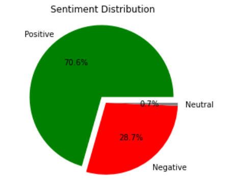

# Airline-Reviews-analysis

## Overview
Airlines play a pivotal role in modern society, serving as the primary mode of transportation for millions of people globally. In the highly competitive airline industry, airlines strive to maintain profitability by keeping a close eye on how customers value their products. Customer reviews wield substantial influence over an airline's profitability and market share. In the age of social media and online platforms, customers have a powerful voice that can shape public perception and consumer behavior. Positive reviews can bolster an airline's reputation, attracting new customers and fostering loyalty among existing ones. Conversely, negative reviews can tarnish a company's image, leading to decreased customer trust, diminished brand loyalty, and ultimately, reduced profitability.

## Task
The below project is focused on scraping and collecting customer feedback and reviewing data from a website and analyzing this data to uncover any insights. The website used for this purpose is Skytrax which is one of the most well-known platforms for airline reviews and ratings. It provides comprehensive information about airlines, airports, and lounges. Travelers can rate and review airlines based on various aspects such as seat comfort, cabin service, food and beverages, and overall experience.

## Process

* Web scraping reviews from Skytrax website using Python using BeautifulSoup and requests packages
* Storing scraped data to a .csv file
* Loading and cleaning the data including removing punctutation's, tokenizing the reviews, filtering stopwords, lemmatizing the reviews
* Word frequency
* Word cloud of airline reviews
* Sentiment analysis using textblob
* Topic Modelling using Latent Dirichlet analysis(LDA)

## Visualization

